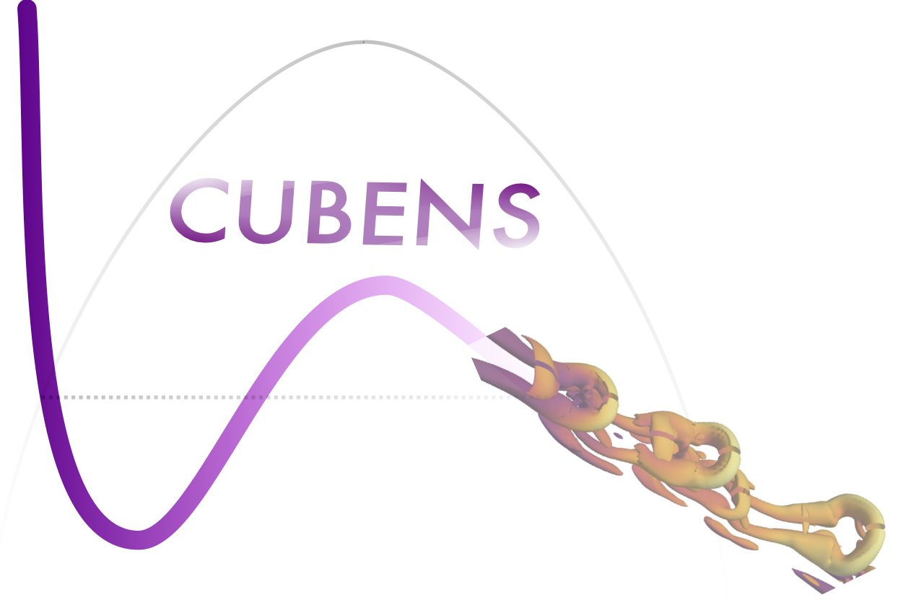

## Main
CUBENS (CUBic Equation of state Navier-Stokes) is a massively-parallel GPU-accelerated solver for direct numerical simulations of non-ideal wall-bounded flows. 
### Features
It incorporates:
 - non-ideal, strongly non-linear thermodynamics,
 - a wall-normal buoyant force,
 - high-order finite-difference schemes with convective terms in split and kinetic-energy- and entropy-preserving form,
 - non-ideal non-reflecting boundary conditions,
 - GPU-acceleration using OpenACC directives for computation offloading and asynchronous CUDA-aware MPI for GPU-GPU communication.

The following geometries can be simulated:
 - transitional boundary layer,
 - turbulent boundary layer,
 - channel flow.

Current developments:
 - extension of the GPU-acceleration to other GPU architectures, e.g. AMD cards,
 - suitable shock-capturing techniques for the supersonic and hypersonic flow regime,
 - curvilinear coordinates for more realistic geometries.

### Reference 
For more information on CUBENS:

P.C.Boldini, R.Hirai, P.Costa, J.W.R.Peeters, R.Pecnik, "CUBENS: development of a GPU-accelerated solver for wall-bounded flows with non-ideal fluids", Submitted to ..., 2024. [link_to_paper](http://example.com)

## News
# **[2024/../..]** CUBENS v1.0 is online!

### Usage

## Motivation
The application of non-ideal fluids has rapidly and widely increased the relevance of a new branch of fluid mechanics called non-ideal compressible fluid dynamics. With respect to the rising number of industrial applications operating at non-ideal gas conditions, such as turbomachinery and heat exchangers, the development of more accurate theoretical, experimental, and numerical tools is required. In particular, one major challenge is the lack of knowledge in transitional and turbulent boundary layers due to the difficulty in performing experiments at high density and temperature conditions. On the contrary, high-fidelity simulations can significantly contribute to improve and accelerate the design of new engineering systems operating at non-ideal conditions. Fluids above their critical point play a key role in future energy conversion systems.

## Contributing

Any contributions and feedback that can improve CUBENS are appreciated. If you wish to contribute to the tool, please get in touch with the maintainers or open an Issue in the repository / a thread in Discussions.

## Final notes 

CUBENS is licensed under the MIT license.

